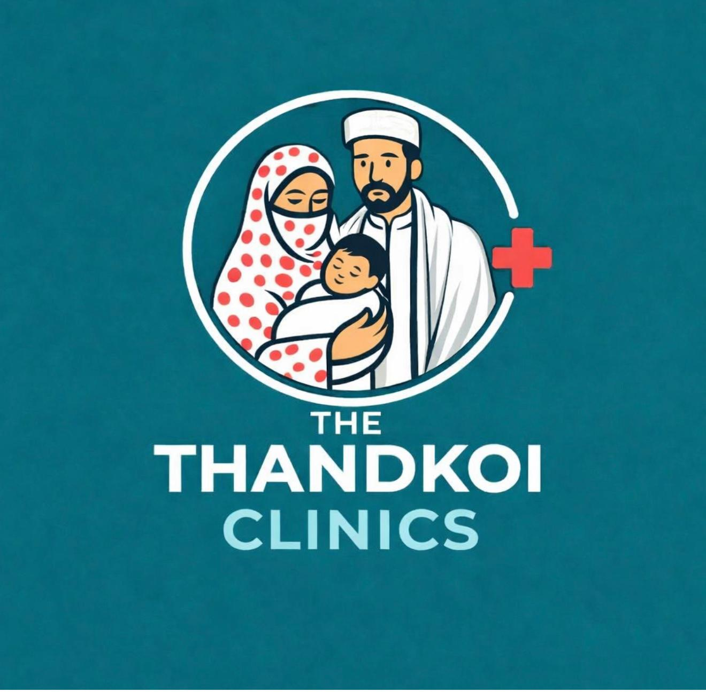

# Thandkoi Clinics — Brand Guidelines

_Last updated: 2026-07-19 · Status: draft for sign-off_

These guidelines define the visual identity for the website and all digital
material. **The logo is the authority** — all colours below are sampled from the
official logo (see [`brand/`](../brand/)).

> Earlier drafts inferred colours from the newsletters and drifted toward a deep
> pine-teal + mint + amber. The logo corrects this: the brand is a **mid
> teal-cyan** with a **coral-red** accent and a **pale-aqua** secondary. This
> document is now aligned to the logo.

## 1. Logo

The mark is a circular ring enclosing an illustrated family (mother, father,
swaddled child) with a red medical cross where the ring opens, above the wordmark
**THE / THANDKOI / CLINICS**.

<picture>
  <source media="(prefers-color-scheme: dark)" srcset="../brand/logo-reversed.png">
  
</picture>

### Light and dark versions

The wordmark and ring are **white**, so the logo needs a different treatment per
background:

| Version | File | Use on |
|---|---|---|
| **Light / default** | [`brand/logo-primary.jpg`](../brand/logo-primary.jpg) | Light and neutral backgrounds — the self-contained teal badge. |
| **Dark / reversed** | [`brand/logo-reversed.png`](../brand/logo-reversed.png) | Dark or teal backgrounds (footer, dark theme) — transparent, so the white ring + wordmark show. **Do not place on white** (they'd disappear). |

Other assets in [`brand/`](../brand/): `logo-variant-orange-cap.jpg` and product
mockups.

- **Clear space:** padding equal to the ring's stroke height around the mark.
- **Minimum size:** ~140px wide so the illustration stays legible.
- **Don't:** recolour, stretch, add effects, or place the light badge on a busy
  photo.
- **Practical note:** these files are raster (detailed faces). For small sizes,
  favicons, and single-colour uses we should commission a **simplified vector
  version** (ring + cross + wordmark) — the family illustration doesn't reproduce
  well below ~80px, and the reversed PNG is auto-generated from the raster.
  _Vector export still needed._

## 2. Colour palette

All values sampled from `brand/logo-primary.jpg`.

### Core brand

| Token | Hex | Role |
|---|---|---|
| Teal Brand (primary) | `#086C7E` | The logo teal. Brand ground, dark sections, primary buttons (white text) |
| Teal Deep | `#0A3E48` | Footer / deepest ground; max-contrast text on light |
| Teal Bright | `#12879B` | Hover / active states |
| Pale Aqua | `#A0E0E8` | The "CLINICS" tone. Light accent + highlights **on dark** — not small text on light |
| Aqua Tint | `#E4F4F6` | Soft section backgrounds, dividers |

### Accent — coral (the cross & heart)

| Token | Hex | Role |
|---|---|---|
| Coral | `#EF5148` | Brand accent; medical-cross & heart motif; **primary call-to-action (Donate)** |
| Coral Deep | `#D83A30` | Coral button fills / hover (better text contrast) |
| Peach | `#F0B878` | Illustration warmth; optional soft wash. Decorative only |

### Neutrals (cyan-teal biased, so they read as chosen)

| Token | Hex | Role |
|---|---|---|
| Ink | `#0E2025` | Primary text |
| Ink Soft | `#3E5257` | Secondary text |
| Ink Faint | `#728A8F` | Captions, meta |
| Border | `#E0E7E8` | Hairlines, card edges |
| Paper | `#F2F6F6` | Page background (light) |
| Card | `#FFFFFF` | Cards, panels |

### Accessibility (WCAG AA) — read before using colour for text

- ✅ **Ink on Paper/Card** — the default for body text.
- ✅ **White on Teal Brand / Teal Deep** — safe for buttons and dark sections.
- ✅ **Teal Deep on white** — safe for links/headings; use Teal Deep (not Teal
  Brand) for small text on white to stay above 4.5:1.
- ⚠️ **Coral** — use **Coral Deep** for button fills, with **white bold ≥16px**
  text (large-text AA). Coral is not for small body text on white.
- ⚠️ **Pale Aqua / Peach** — decorative / on-dark only; never body text on light.
- "Free / Zakat beneficiary" badges use **Teal**, not a new colour.

Body text ≥16px; visible keyboard focus; design both themes (re-tune tokens,
don't naively invert).

## 3. Typography

The wordmark is a **bold sans**, so the type system is sans-forward. All faces are
open-source (SIL OFL), free, and self-hostable.

| Role | Typeface | Notes |
|---|---|---|
| Headings / display | **Archivo** (Bold/ExtraBold) | Wide grotesque matching the "THANDKOI" wordmark. Alt: Libre Franklin. |
| Body & UI | **Public Sans** (400/600) | Clean, screen-legible. Alt: Source Sans 3. |
| Data & report figures | Public Sans, `tabular-nums` | Aligns report columns. |
| Urdu (Nastaliq) | **Noto Nastaliq Urdu** | Headings/quotes: چراغ شفا, صحت سب کے لیے. |
| Urdu / Arabic (UI) | **Noto Naskh Arabic** | Inline labels where Nastaliq is too tall. |

Wordmark styling echoes the logo: small "THE", heavy "THANDKOI", lighter "CLINICS"
in Pale Aqua on teal.

**Type scale** (1.25): 0.8 / 1.0 / 1.25 / 1.563 / 1.953 / 2.441 rem. Running text
~65 characters wide; `text-wrap: balance` on headings; uppercase labels ~0.14em
letter-spacing.

_Serif is optional for long-form editorial only; the default UI is sans._

## 4. Layout & spacing

- Base unit **8px** (compose 8/16/24/32/48/64).
- Generous whitespace; calm and uncluttered — healthcare, not retail.
- Cards: 12px radius, 1px Border, soft shadow.
- Reading pages ~720px wide; wider grids for galleries/reports.

## 5. Imagery

- Real clinic, camp, and community photography; warm, natural light.
- **Dignity & consent:** never publish identifiable patient images without
  explicit consent; prefer context shots where consent is unclear. (Brand rule
  *and* privacy rule.)
- The logo's family illustration is the signature graphic — use it rather than
  generic stock.

## 6. Voice & tone

- **Compassionate, dignified, clear.** Plain language, minimal jargon.
- **Community-first** and faith-respectful (Zakat, Sadaqa, sincerity).
- **Honest and specific** — real numbers and stories, no over-claiming.
- **Bilingual by default** — English and Urdu given equal care; Pashto may follow.

## 7. Do / Don't

- ✅ Anchor on Teal Brand; use Coral for the donate action and the cross/heart.
- ✅ Let whitespace and type carry the page.
- ✅ Give Urdu the same care as English (RTL, proper Nastaliq).
- ❌ Don't reintroduce navy/mint/amber — they aren't in the logo.
- ❌ Don't use Coral, Pale Aqua, or Peach for small body text.
- ❌ Don't add gradients, heavy shadows, or emoji as section markers.

## 8. Open items

- Commission a **vector version** of the logo (colour / reversed / single-colour)
  for small sizes and favicons.
- Confirm **Coral** as the donate/CTA colour (replaces the earlier amber idea).
- Confirm the **sans** type direction (Archivo + Public Sans).
