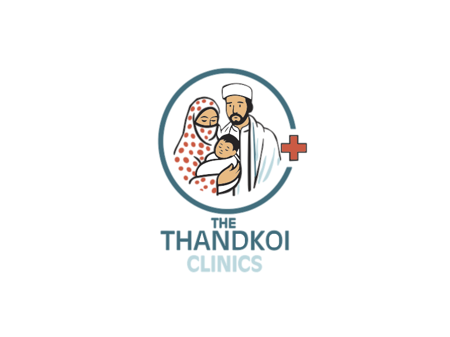

# Thandkoi Clinics — Brand Guidelines

_Last updated: 2026-07-19 · Status: draft for sign-off_

These guidelines define the visual identity for the website and all digital
material. **The logo is the authority** — all colours below are sampled from the
official logo (see [`brand/`](../brand/)).

> Earlier drafts inferred colours from the newsletters and drifted toward a deep
> pine-teal + mint + amber as general brand colours. The logo corrects this: the
> brand is a **mid teal-cyan** with a **coral-red** accent (cross/heart motif
> only) and a **pale-aqua** secondary. This document is now aligned to the logo.
> Amber reappears once, deliberately, as the Donate button colour (§2) — coral
> read as alarming for a donation ask; it is not a return to the earlier
> inferred palette.

## 1. Logo

The mark is a circular ring enclosing an illustrated family (mother, father,
swaddled child) with a red medical cross where the ring opens, above the wordmark
**THE / THANDKOI / CLINICS**.

<picture>
  
</picture>

### Vector assets (primary — use these)

The logo is now true vector (SVG), professionally traced, transparent
background. Because the ring is an outline (not a solid disc) with enough
contrast in its own right, **one asset works on both light and dark
backgrounds** — no separate light/dark files needed.

| File | Use |
|---|---|
| [`brand/logo.svg`](../brand/logo.svg) | Full lockup — mark + wordmark. Primary logo for header, footer, print. |
| [`brand/logo-mark.svg`](../brand/logo-mark.svg) | Mark only, no wordmark. Square-ish crop, for contexts too narrow for the full lockup (social avatar, app icon). |
| [`brand/favicon.svg`](../brand/favicon.svg) / `favicon-32.png` / `favicon-180.png` / `favicon-512.png` | Browser tab / bookmark / home-screen icons. |

- **Clear space:** padding equal to the ring's stroke height around the mark.
- **Minimum size:** ~140px wide for the full lockup so the illustration stays
  legible.
- **Don't:** recolour, stretch, or add effects.
- **Known limitation:** the illustration has real detail (individual faces, a
  polka-dot pattern) that gets muddy at 32px — the 32px favicon export is
  usable but not crisp. If a cleaner tiny-icon treatment is ever needed,
  a deliberately simplified icon (ring + cross only) would read better than
  shrinking the full mark further.

### Legacy raster assets

[`brand/logo-primary.jpg`](../brand/logo-primary.jpg) and
[`brand/logo-reversed.png`](../brand/logo-reversed.png) are the original raster
files the vector assets above were traced from — kept for reference, superseded
by the SVGs for all actual use. Other assets in [`brand/`](../brand/):
`logo-variant-orange-cap.jpg` and product mockups.

## 2. Colour palette

All values sampled from `brand/logo-primary.jpg`.

### Core brand

| Token | Hex | Role |
|---|---|---|
| Teal Brand (primary) | `#086C7E` | The logo teal. Brand ground, dark sections, primary buttons (white text) |
| Teal Deep | `#0A3E48` | Footer / deepest ground; max-contrast text on light |
| Teal Bright | `#12879B` | Hover / active states |
| Pale Aqua | `#A0E0E8` | The "CLINICS" tone. Light accent + highlights **on dark** — not small text on light |
| Aqua Tint | `#E4F4F6` | Soft section backgrounds, dividers |

### Accent — coral (the cross & heart only)

| Token | Hex | Role |
|---|---|---|
| Coral | `#EF5148` | Brand accent; medical-cross & heart motif **only** — not for buttons or CTAs |
| Coral Deep | `#D83A30` | Coral fills / hover, where coral is used decoratively |
| Peach | `#F0B878` | Illustration warmth; optional soft wash. Decorative only |

### Accent — amber (Donate call-to-action)

Coral read as alarming/negative for a donation ask, so Donate gets its own warm,
welcoming accent instead — coral stays reserved for the cross/heart motif.

| Token | Hex | Role |
|---|---|---|
| Amber (light) | `#CE8A2C` | **Primary Donate CTA** on light backgrounds |
| Amber (dark) | `#E8B04A` | **Primary Donate CTA** on dark backgrounds — lighter for contrast |

### Neutrals (cyan-teal biased, so they read as chosen)

| Token | Hex | Role |
|---|---|---|
| Ink | `#0E2025` | Primary text |
| Ink Soft | `#3E5257` | Secondary text |
| Ink Faint | `#728A8F` | Captions, meta |
| Border | `#E0E7E8` | Hairlines, card edges |
| Paper | `#F2F6F6` | Page background (light) |
| Card | `#FFFFFF` | Cards, panels |

### Accessibility (WCAG AA) — read before using colour for text

- ✅ **Ink on Paper/Card** — the default for body text.
- ✅ **White on Teal Brand / Teal Deep** — safe for buttons and dark sections.
- ✅ **Teal Deep on white** — safe for links/headings; use Teal Deep (not Teal
  Brand) for small text on white to stay above 4.5:1.
- ⚠️ **Coral** — decorative use only (cross/heart motif); if ever used as a fill,
  use **Coral Deep** with **white bold ≥16px** text (large-text AA). Not for
  small body text on white.
- ⚠️ **Amber** — use **Amber (dark) `#E8B04A`** with dark ink text, or **Amber
  (light) `#CE8A2C`** with white text, to stay above 4.5:1 for the Donate CTA.
- ⚠️ **Pale Aqua / Peach** — decorative / on-dark only; never body text on light.
- "Free / Zakat beneficiary" badges use **Teal**, not a new colour.

Body text ≥16px; visible keyboard focus; design both themes (re-tune tokens,
don't naively invert).

## 3. Typography

The wordmark is a **bold sans**, so the type system is sans-forward. All faces are
open-source (SIL OFL), free, and self-hostable.

| Role | Typeface | Notes |
|---|---|---|
| Headings / display | **Archivo** (Bold/ExtraBold) | Wide grotesque matching the "THANDKOI" wordmark. Alt: Libre Franklin. |
| Body & UI | **Public Sans** (400/600) | Clean, screen-legible. Alt: Source Sans 3. |
| Data & report figures | Public Sans, `tabular-nums` | Aligns report columns. |
| Urdu (Nastaliq) | **Noto Nastaliq Urdu** | Headings/quotes: چراغ شفا, صحت سب کے لیے. |
| Urdu / Arabic (UI) | **Noto Naskh Arabic** | Inline labels where Nastaliq is too tall. |

Wordmark styling echoes the logo: small "THE", heavy "THANDKOI" in Teal Brand,
lighter "CLINICS" in Pale Aqua.

**Type scale** (1.25): 0.8 / 1.0 / 1.25 / 1.563 / 1.953 / 2.441 rem. Running text
~65 characters wide; `text-wrap: balance` on headings; uppercase labels ~0.14em
letter-spacing.

_Serif is optional for long-form editorial only; the default UI is sans._

## 4. Layout & spacing

- Base unit **8px** (compose 8/16/24/32/48/64).
- Generous whitespace; calm and uncluttered — healthcare, not retail.
- Cards: 12px radius, 1px Border, soft shadow.
- Reading pages ~720px wide; wider grids for galleries/reports.

## 5. Imagery

- Real clinic, camp, and community photography; warm, natural light.
- **Dignity & consent:** never publish identifiable patient images without
  explicit consent; prefer context shots where consent is unclear. (Brand rule
  *and* privacy rule.)
- The logo's family illustration is the signature graphic — use it rather than
  generic stock.

## 6. Voice & tone

- **Compassionate, dignified, clear.** Plain language, minimal jargon.
- **Community-first** and faith-respectful (Zakat, Sadaqa, sincerity).
- **Honest and specific** — real numbers and stories, no over-claiming.
- **Bilingual by default** — English and Urdu given equal care; Pashto may follow.

## 7. Do / Don't

- ✅ Anchor on Teal Brand; use Amber for the donate action, Coral only for the
  cross/heart motif.
- ✅ Let whitespace and type carry the page.
- ✅ Give Urdu the same care as English (RTL, proper Nastaliq).
- ❌ Don't reintroduce navy/mint — they aren't in the logo.
- ❌ Don't use Amber anywhere except the Donate CTA — it's a deliberate, scoped
  exception, not a general brand colour.
- ❌ Don't use Coral, Pale Aqua, or Peach for small body text.
- ❌ Don't add gradients, heavy shadows, or emoji as section markers.

## 8. Open items

- None outstanding — logo (vector, §1), colour palette incl. Donate accent
  (§2), and type direction (§3, Archivo + Public Sans) are all confirmed.
  This document can move from draft to final on sign-off.
